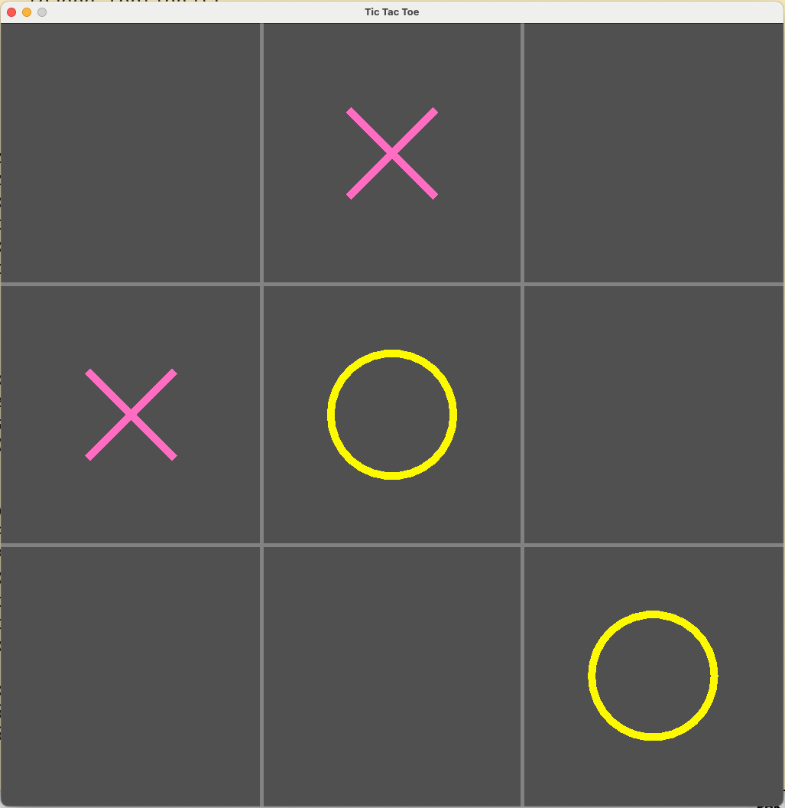

# XOXO

This is a Tic Tac Toe game created with Raylib.

1. To run this example, a [raylib](https://github.com/raysan5/raylib) should be installed.
2. To make the library visible in IDE, run `./init_clangd.sh`.
3. To compile the program, run `make` and then `./main`.
4. The result should look like so: 

